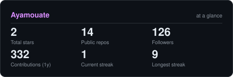

<!-- BANNER - terminal profile.sh --live (additive). Generated by scripts/banner/generate.py.
     ~0.9 MB each. Cache-bust with ?v=N after regenerating. -->
<picture>
  <source media="(prefers-color-scheme: dark)"  srcset="assets/banner-dark.v9.svg">
  <source media="(prefers-color-scheme: light)" srcset="assets/banner-light.v9.svg">
  
</picture>

 

<!-- NAME / TAGLINE - animated typing -->

 

<!-- 42 BADGE -->

  

<!-- SOCIALS - add LinkedIn / Instagram / X here the same way if you want them. -->
&nbsp;&nbsp;
&nbsp;&nbsp;

 

---

## This is me :)

### 👩‍💻 Computer Science Student @ 1337 & UCA

*Exploring systems, AI, algorithms and the magic behind how things work.*

- 🎓 Computer Science student at **1337 (42 Network)** & **UCA**
- 💻 Interested in **systems programming, AI & web technologies**
- 🧠 I enjoy solving algorithmic and optimization problems
- 🚀 Building projects that push me beyond my comfort zone
- ✨ *Dream big. Work smart. Stay kind.*

 

## my perfect stack

### Languages

### Tools & Technologies

### Platforms & other tools

---

## signals

<table>
<tr>
<td width="50%" align="center" valign="middle">

<!-- Self-rated radar - edit assets/skills.json, the workflow redraws it -->
<picture>
  <source media="(prefers-color-scheme: dark)"  srcset="assets/radar-dark.svg">
  <source media="(prefers-color-scheme: light)" srcset="assets/radar-light.svg">
  
</picture>

</td>
<td width="50%" align="center" valign="middle">

<!-- Hand-authored language radar - edit assets/langmix.json -->
<picture>
  <source media="(prefers-color-scheme: dark)"  srcset="assets/radar-langs-dark.svg">
  <source media="(prefers-color-scheme: light)" srcset="assets/radar-langs-light.svg">
  
</picture>

</td>
</tr>
</table>

---

## 📊 GitHub Stats

<!-- Generated by scripts/cards.py into this repo (replaces github-readme-stats, which
     is a shared public instance that goes down and takes the whole section with it). -->
<picture>
  <source media="(prefers-color-scheme: dark)"  srcset="assets/card-stats-dark.svg">
  <source media="(prefers-color-scheme: light)" srcset="assets/card-stats-light.svg">
  
</picture>
 
<!-- Generated by scripts/languages.py (python scripts/languages.py) -->

---

<i>Always learning . Always building</i>

  

### ✨ Dream big. Work smart. Stay kind. ✨

<i>Thanks for stopping by 🌸</i>

 

<picture>
  <source media="(prefers-color-scheme: dark)"  srcset="https://raw.githubusercontent.com/Ayamouate/Ayamouate/output/github-snake-dark.svg" />
  <source media="(prefers-color-scheme: light)" srcset="https://raw.githubusercontent.com/Ayamouate/Ayamouate/output/github-snake.svg" />
  
</picture>

